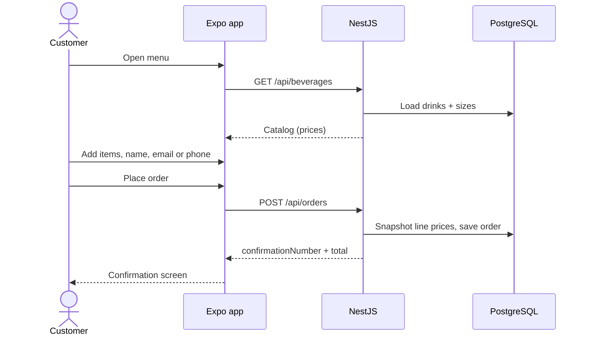

# Lemonade Stand

Customer app and API for a digital lemonade stand. Browse drinks from the live catalog, build a cart, and place an order. The **server calculates the total** and returns a confirmation number.

Frontend and backend live in one public repository:

```text
lemonade-stand-application/
├── docker-compose.yml   PostgreSQL (localhost:5433)
├── server/              NestJS API  →  http://localhost:3000/api
└── client/              Expo (React Native) app
```

Admin create/update/delete of drinks is done through Swagger, not in the phone app.

---

## Prerequisites

- Node.js 20 or later
- npm
- Docker Desktop (PostgreSQL)
- [Expo Go](https://expo.dev/go) on a phone, **or** a browser for the web preview

---

## Run the API

```bash
# from the repository root
docker compose up -d

cd server
cp .env.example .env   # Windows: copy .env.example .env
npm install
npm run start:dev
```

PostgreSQL is on **localhost:5433** (container 5432) so it does not collide with a local Postgres on 5432.

| URL | Purpose |
| --- | --- |
| http://localhost:3000/api/health | Health check |
| http://localhost:3000/docs | Swagger (admin + try requests) |
| `GET /api/beverages` | Catalog with sizes and prices |
| `POST /api/orders` | Place an order (server total + confirmation) |
| `GET /api/orders/:confirmationNumber` | Look up an order |

On Windows, allow inbound **3000** (API) and **8081** (Metro) if you use a physical phone.

---

## Run the app

Keep Nest running. In a second terminal:

```bash
cd client
npm install
npx expo start
```

- **Phone:** scan the QR code with Expo Go. The phone must be on the **same Wi-Fi** as your PC. The app does **not** use `localhost` on device — it uses the LAN IP Expo already printed (for example `10.0.0.169`).
- **Web:** press `w` in the Expo terminal. The browser talks to `http://localhost:3000/api`.

Optional override (must include `/api`):

```bash
# client/.env
EXPO_PUBLIC_API_URL=http://10.0.0.169:3000/api
```

Pull down on the menu to refresh drinks after you change the catalog in Swagger.

### If the menu cannot load

The app maps failures to a specific message:

| You see | Typical cause |
| --- | --- |
| Can't reach the API… | Nest is not running, firewall, or phone on a different network |
| Request timed out… | Nest started but did not answer in time |
| The server had a problem… | Nest returned HTTP 5xx |
| Validation / item not available | Nest returned HTTP 4xx with a message |

Fix the cause, then tap **Retry** (menu) or **Place order** again (cart).

---

## Order flow



The client shows a live total while shopping. **Charged amount is always the server total** on the confirmation screen.

---

## Architecture

**API (`/server`)** — NestJS 11, TypeORM, PostgreSQL. Validation with `class-validator`. Money stored as `numeric(12,2)` and totaled in integer cents. Orders snapshot drink/size names and unit price so later catalog edits do not rewrite history. Confirmation numbers retry on unique-constraint collisions. Unhandled exceptions return a consistent JSON body (`statusCode`, `message`, `path`).

**App (`/client`)** — Expo SDK 54, Expo Router (Menu → Cart → Confirmation). Cart is React Context. HTTP client is generated from Nest OpenAPI with [Kubb](https://kubb.dev); menu and checkout use TanStack Query. Queries retry only transient network failures, never `POST /orders`.

Regenerate the typed client after API changes (Nest must be running):

```bash
cd client
npm run openapi:pull
npm run generate:api
```

---

## Tests

```bash
# API (Nest)
cd server
npm test
npm run test:e2e

# App (Jest — cart, checkout validation, API error mapping)
cd client
npm test
```

---

## Assignment notes

- Drinks are not hardcoded in the app. They come from `GET /api/beverages`.
- Phone **or** email is required (same rule on client and Nest).
- Network, timeout, validation, and server errors are shown on screen with a way to retry.
- Admin UI is Swagger at `/docs`.
