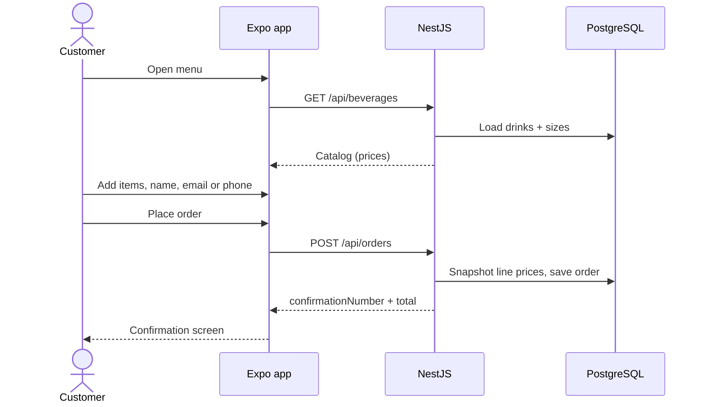

# Lemonade Stand

Customer app and API for a digital lemonade stand. Browse drinks from the live catalog, build a cart, and place an order. The **server calculates the total** and returns a confirmation number.

Frontend and backend live in one public repository:

```text
lemonade-stand-application/
├── docker-compose.yml   PostgreSQL
├── server/              NestJS API  →  http://localhost:3000/api
└── client/              Expo (React Native) app
```

---

## Prerequisites

- Node.js 20 or later
- npm
- Docker Desktop (for PostgreSQL)
- [Expo Go](https://expo.dev/go) on a phone, **or** a browser for the web preview

---

## Setup, build, and run

### 1. Database

From the repository root:

```bash
docker compose up -d
```

PostgreSQL is on **localhost:5433** (container port 5432) so it does not collide with a local Postgres on 5432.

### 2. Backend (`/server`)

```bash
cd server
cp .env.example .env   # Windows: copy .env.example .env
npm install
npm run start:dev      # watch mode for local development
```

Production-style build (optional):

```bash
cd server
npm run build
npm run start:prod
```

| URL | Purpose |
| --- | --- |
| http://localhost:3000/api/health | Health check |
| http://localhost:3000/docs | Swagger — admin create/update/delete for drinks and sizes |
| `GET /api/beverages` | Catalog with sizes and prices |
| `POST /api/orders` | Place an order |
| `GET /api/orders/:confirmationNumber` | Look up an order |

On Windows, allow inbound **3000** (API) and **8081** (Metro) if you use a physical phone.

### 3. Frontend (`/client`)

Keep Nest running. In a second terminal:

```bash
cd client
npm install
npx expo start
```

- **Phone:** scan the QR code with Expo Go. The phone must be on the **same Wi-Fi** as your PC. The app does **not** use `localhost` on device — it uses the LAN IP Expo already printed (for example `10.0.0.169`).
- **Web:** press `w` in the Expo terminal. The browser talks to `http://localhost:3000/api`.

There is no native `ios/` / `android/` build in this repo. Expo Go loads the JavaScript bundle. That matches the assignment (Expo is allowed) and is how reviewers can run the app without Xcode or Android Studio.

Optional API override (must include `/api`):

```bash
# client/.env
EXPO_PUBLIC_API_URL=http://10.0.0.169:3000/api
```

Pull down on the menu after you change the catalog in Swagger. The app refetches `GET /api/beverages` — no app rebuild.

### If the menu cannot load

| You see | Typical cause |
| --- | --- |
| Can't reach the API… | Nest is not running, firewall, or phone on a different network |
| Request timed out… | Nest started but did not answer in time |
| The server had a problem… | Nest returned HTTP 5xx |
| Validation / item not available | Nest returned HTTP 4xx with a message |

Fix the cause, then tap **Retry** (menu) or **Place order** again (cart).

---

## Tests

```bash
cd server
npm test
npm run test:e2e

cd client
npm test
```

---

## Assumptions

- **Admin is Swagger, not a phone screen.** The assignment asks for beverage/size CRUD on the API. Reviewers manage the catalog at http://localhost:3000/docs. The React Native app is the customer flow only (menu → cart → confirmation).
- **Phone or email, not both required.** The assignment says the customer provides a phone number *or* an email. Name is always required.
- **The charged total is the server total.** The cart shows a live estimate from catalog prices already in the app. Confirmation shows the amount Nest persisted.
- **Expo Go is the delivery method.** No App Store / Play Store build, push notifications, or login.
- **PostgreSQL is the database.** TypeORM `synchronize` is on in non-production so tables appear on first boot. Do not use that in a real production deploy.
- **North American phone formatting in the app.** The UI stores 10 national digits and submits `+1XXXXXXXXXX`. Nest accepts a slightly wider phone pattern so Swagger/try-it still works.
- **Kubb regenerate is not part of daily run.** `openapi:pull` / `generate:api` are only needed after the Nest contract changes. Nest must be running for the pull.

---

## Design choices

- **One public repo, `/client` and `/server`.** HTTP only between them. No shared runtime.
- **Nest modules** for health, sizes, beverages, and orders (controllers / services / DTOs / entities).
- **Money in integer cents** on the server, stored as `numeric(12,2)`. Order lines snapshot drink name, size name, and unit price so later catalog edits do not rewrite history.
- **React Native:** Expo Router stack (Menu → Cart → Confirmation). Cart is React Context. Menu load and place-order use TanStack Query. The HTTP client is generated from Nest OpenAPI with [Kubb](https://kubb.dev) so types stay aligned with the API.
- **Queries retry only transient network failures.** `POST /orders` never retries.
- **Database in Docker, API on the host.** Compose runs Postgres. Nest stays on the machine so Expo Go on a phone can reach it via the LAN IP (`localhost` inside a container would not be the phone’s PC).

---

## Bonus features

1. **Unit / integration tests** — Nest: service specs (orders total from catalog prices, merge lines, reject unknown sizes) plus e2e. React Native: Jest specs for cart merge/totals, customer validation (name + phone or email), and API error mapping (network, timeout, 4xx, 5xx).
2. **Input validation** — Client: name, email format, 10-digit phone, contact required. Nest: `class-validator` DTOs, whitelist, at-least-one contact, quantity bounds.
3. **State management** — React Context for cart + customer fields; TanStack Query for server state (menu cache, mutation for checkout).
4. **Containerization** — `docker-compose.yml` runs PostgreSQL 16 with a named volume and healthcheck.
5. **User interface** — Menu with sizes/prices, cart badge, quantity steppers, checkout form, confirmation with selectable confirmation number. Keyboard-safe checkout on iOS/Android.
6. **Sequence diagram** — order placement flow below.

---

## Order flow



---

## Error handling

- **Nest:** global `ValidationPipe` and `AllExceptionsFilter` return JSON `{ statusCode, message, path, timestamp }`. Unknown drink/size on an order is `400`. Missing confirmation is `404`. Unexpected failures are `500` without leaking internals.
- **App:** timeouts, “API not reachable”, Nest 4xx messages, and 5xx are mapped to copy on the menu and cart. Retry stays available.

---

## Regenerating the typed client (optional)

Only after Nest API/DTO changes:

```bash
cd client
npm run openapi:pull
npm run generate:api
```

Do not hand-edit `client/src/gen`.
